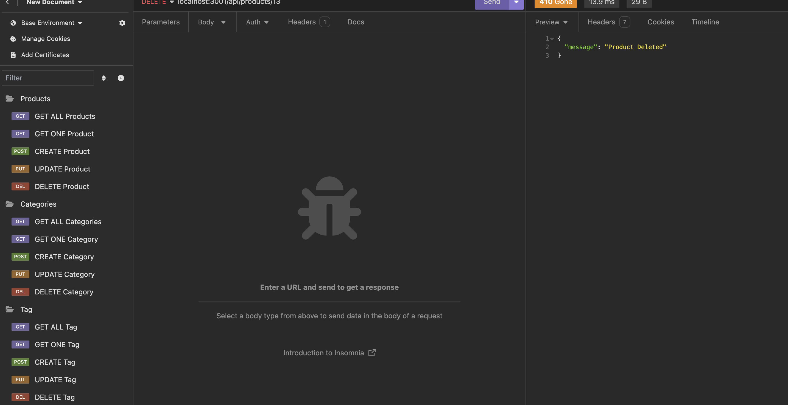

# Ecommy

## Description

Ecommy is an ecommerce backend built to store all of aspects of a ecommerce site including products, prices, categories, and tags. It's ready for you to connect your front end  and go!

Demo: https://youtu.be/jmhQvJhmzP8

## Table of Contents 

- [Installation](#installation)
- [Usage](#usage)
- [Credits](#credits)
- [License](#license)

## Installation
npm install

How do I install Dependencies?
requires node and express.js, dotenv, mysql2 and sequalize.

## Usage

Use ecommy as a backend for your next ecommerce store!

## Credits

## License 

This project is licensed under the MIT License.

Find more about this license here: https://opensource.org/licenses/MIT.

        

## Tests

How do I run tests?
npm i

## Questions

Please direct your questions towards Ben at:
Github: zaczacariah
Email: ben-zac@outlook.com

    